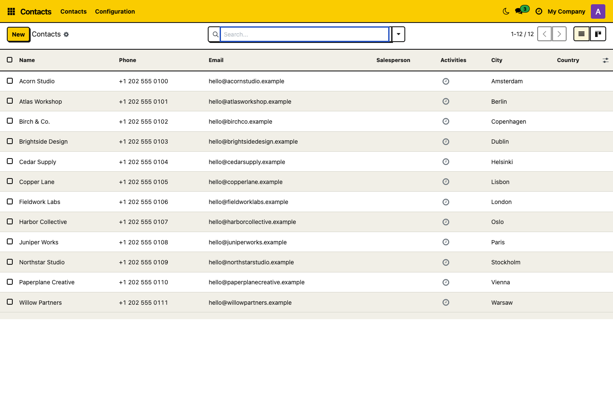
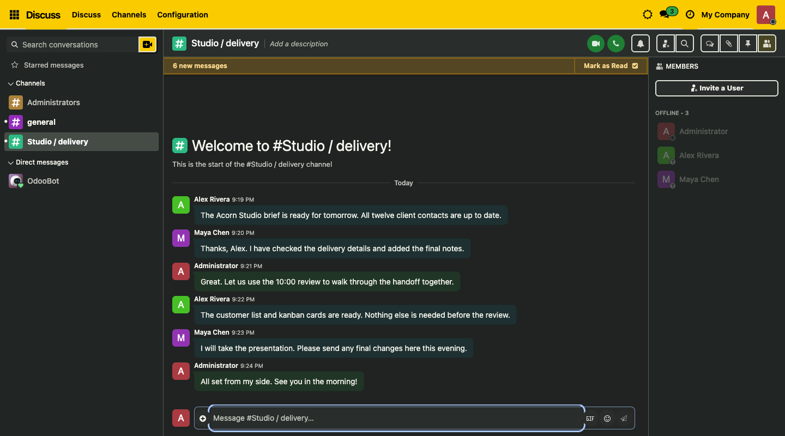

# Odoo Neobrutalism Backend Theme — Odoo 16–19

**Neo Brutal** is an open-source backend theme by **[RivetFox](https://rivetfox.pro)** for Odoo Community. It adds bold outlines, solid shadows, seven administrator-managed accent colors and personal dark mode to the Odoo ERP interface.

## Choose your Odoo version

Run **one command below from your server's existing add-ons directory** (the host directory mounted into Odoo, for example `./addons`). Choose the row matching your Odoo server. Requires Git and a POSIX shell on Linux or macOS.

| Odoo version | Source branch | Download into the current add-ons directory |
| --- | --- | --- |
| Odoo 16 Community | [16.0](https://github.com/Welgum/odoo-neobrutalism-theme/tree/16.0) | `(set -eu; test ! -e neobrutalism_theme; test ! -L neobrutalism_theme; neo_tmp=$(mktemp -d); trap 'rm -rf "$neo_tmp"' EXIT; git clone --depth 1 --single-branch --branch 16.0 https://github.com/Welgum/odoo-neobrutalism-theme.git "$neo_tmp"; mv "$neo_tmp/neobrutalism_theme" ./)` |
| Odoo 17 Community | [17.0](https://github.com/Welgum/odoo-neobrutalism-theme/tree/17.0) | `(set -eu; test ! -e neobrutalism_theme; test ! -L neobrutalism_theme; neo_tmp=$(mktemp -d); trap 'rm -rf "$neo_tmp"' EXIT; git clone --depth 1 --single-branch --branch 17.0 https://github.com/Welgum/odoo-neobrutalism-theme.git "$neo_tmp"; mv "$neo_tmp/neobrutalism_theme" ./)` |
| Odoo 18 Community | [18.0](https://github.com/Welgum/odoo-neobrutalism-theme/tree/18.0) | `(set -eu; test ! -e neobrutalism_theme; test ! -L neobrutalism_theme; neo_tmp=$(mktemp -d); trap 'rm -rf "$neo_tmp"' EXIT; git clone --depth 1 --single-branch --branch 18.0 https://github.com/Welgum/odoo-neobrutalism-theme.git "$neo_tmp"; mv "$neo_tmp/neobrutalism_theme" ./)` |
| Odoo 19 Community | [19.0](https://github.com/Welgum/odoo-neobrutalism-theme/tree/19.0) | `(set -eu; test ! -e neobrutalism_theme; test ! -L neobrutalism_theme; neo_tmp=$(mktemp -d); trap 'rm -rf "$neo_tmp"' EXIT; git clone --depth 1 --single-branch --branch 19.0 https://github.com/Welgum/odoo-neobrutalism-theme.git "$neo_tmp"; mv "$neo_tmp/neobrutalism_theme" ./)` |

Each command clones the matching branch into a temporary directory, places only the installable `neobrutalism_theme/` folder in the current directory, and removes the temporary checkout. The result is `ADDONS_PATH/neobrutalism_theme/__manifest__.py`, with no extra repository folder. Commands stop if `neobrutalism_theme` already exists; use the update instructions below for an existing installation.

The module keeps the same technical name across versions. The source repository retains the layout used by the Odoo Apps repository scanner. `main` follows Odoo 19; register the numbered branches for publication.

## Theme features

- **Seven accent presets:** Yellow, Blue, Green, Purple, Pink, Orange and Red, with swatches in Settings → Neo Brutal. Only Settings administrators can change shared colors.
- **Personal dark mode:** switch from the top bar without reloading open forms or losing message drafts. Each user controls their own mode.
- **Dark Odoo components:** consistent surfaces for Discuss, Calendar, CRM, Project, forms, lists, kanban boards, standard charts and pivot tables.
- **Personal appearance:** comfortable/compact table spacing and an option to disable the theme.
- **Browser privacy:** personal choices stay in the current browser, user and database. No external fonts, CDNs, activation keys or analytics.

Dependencies are only `web` and `base_setup`. Optional apps shown in screenshots are not installed by this theme. The add-on is intended for self-hosted Odoo Community; Enterprise-specific screens, Odoo.sh deployment and third-party themes require separate verification. Odoo Online cannot install this filesystem add-on. Websites, portals, POS and PDF reports are outside its scope.

## Screenshots

The screenshots below belong to the Odoo version of the currently selected branch and show fictional demonstration records.





## Install the theme

Use the command for your Odoo version in the table above from your existing add-ons directory. It downloads the correctly named module directly into that directory.

Ensure the directory containing `neobrutalism_theme/` is on Odoo's `addons_path`. For Docker, mount that host directory into the container's custom add-ons path, for example `./addons:/mnt/extra-addons`, with `/mnt/extra-addons` in `addons_path`. Preserve existing paths, mounts and database volumes.

Restart Odoo, enable developer mode, and open **Apps → Update Apps List**. Remove the default **Apps** filter, search for **Neo Brutal Backend Theme**, and install it. Reload the browser. For an existing installation, replace the module files, restart Odoo and choose **Upgrade** before refreshing the browser.

**Updating an older checkout:** earlier releases kept the manifest at the repository root. The add-on now lives one directory deeper. Adjust the mount/add-ons path or copy the inner `neobrutalism_theme/` directory so Odoo still sees `ADDONS_PATH/neobrutalism_theme/__manifest__.py`.

[Detailed installation, color settings and troubleshooting](neobrutalism_theme/README.md) · [User documentation](neobrutalism_theme/doc/index.rst)

## Validation and release packages

From the repository root:

```bash
node neobrutalism_theme/tests/test_preferences.mjs
python3 tools/build_release.py
```

The builder validates the manifest, description, asset paths and images, then writes a deterministic installable ZIP, checksum and listing preview to `dist/`. The ZIP contains one `neobrutalism_theme/` directory. See the branch's [validation record](neobrutalism_theme/VALIDATION.md) for its actual Odoo installation and browser checks.

[Odoo Apps publication instructions](PUBLISHING.md) · [Changelog](neobrutalism_theme/CHANGELOG.md) · [Report an issue](https://github.com/Welgum/odoo-neobrutalism-theme/issues)

## RivetFox and license

Developed by **[RivetFox](https://rivetfox.pro)**. Source: [Welgum/odoo-neobrutalism-theme](https://github.com/Welgum/odoo-neobrutalism-theme).

Licensed under **[LGPL-3.0-or-later](LICENSE)**. The visual design is inspired by [ekmas/neobrutalism-components](https://github.com/ekmas/neobrutalism-components); its MIT attribution is preserved in [THIRD_PARTY_NOTICES.md](THIRD_PARTY_NOTICES.md).
