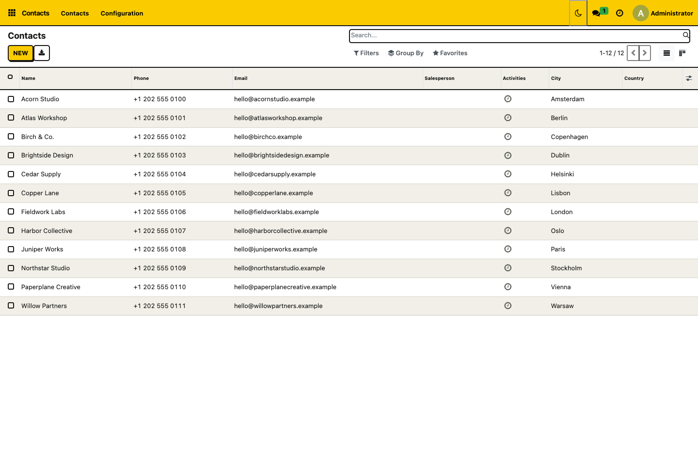

# Odoo 18 Neobrutalism Backend Theme

**Neo Brutal** is an open-source **Odoo 18 Community backend theme** by [RivetFox](https://rivetfox.pro). It brings neobrutalism design to the Odoo ERP interface with bold outlines, solid shadows, seven accent color presets and personal **dark mode**.

Customize Odoo lists, forms, kanban boards and navigation, with dark styles for Discuss, Calendar, CRM, Project and standard charts. Administrators manage shared colors; each user chooses light or night mode from the top bar without losing unsaved work.

**Repository:** [odoo-neobrutalism-theme](https://github.com/Welgum/odoo-neobrutalism-theme) · **Author:** [RivetFox](https://rivetfox.pro) · **License:** [LGPL-3.0-or-later](LICENSE)

**Version:** `18.0.1.0.3` · **Odoo module:** `neobrutalism_theme` · **Dependencies:** `web`, `base_setup`.

[Features](#odoo-backend-theme-features) · [Screenshots](#odoo-theme-screenshots) · [Installation](#install-the-odoo-theme-with-docker-or-on-a-vps) · [Colors and dark mode](#customize-odoo-theme-colors-and-dark-mode) · [FAQ](#frequently-asked-questions-and-troubleshooting)

## Odoo version and hosting compatibility

Built for self-hosted **Odoo 18 Community**. It uses shared web-client components, but Enterprise-specific screens and third-party themes have not been verified. It can also be deployed as source through Odoo.sh. Odoo Online does not support installing this filesystem add-on. This is a backend theme, not a Website/eCommerce theme.

## Odoo backend theme features

- Navigation, control panels, search fields and facets.
- Primary/secondary buttons with solid shadows and visible keyboard focus.
- List tables, form sheets, notebook tabs, kanban cards, menus and dialogs.
- **Settings → Neo Brutal** for seven administrator-only accent presets: Yellow, Blue, Green, Purple, Pink, Orange and Red.
- A **sun/moon button in the top bar** for each user to switch day/night mode without reloading.
- Comfortable or compact table spacing.
- **User avatar → Appearance** to change options, reset, or turn the theme off.
- Personal options isolated by browser origin, database and user; synchronized between tabs.
- Complete private dark asset bundles for Odoo components, including Discuss, Calendar and standard graph/pivot views.
- Reduced motion support and screen-only styles.

The default is **yellow + comfortable + enabled** for each user. The shared accent preset is Yellow initially. Each user can choose day/night mode independently; until then, the theme follows Odoo's loaded color scheme. No external fonts, CDNs, React, Tailwind build step or additional Python packages are required. Shared settings use Odoo's standard settings model and database parameters; only Settings administrators can change them. Odoo's existing menus, permissions, fields, widgets, state colors and business actions are retained. The add-on does not add new sales screens or sample records.

## Odoo theme screenshots

### Light mode: Contacts and backend navigation



### Dark mode: Odoo Discuss


These screenshots show actual Odoo 18 Community screens with demonstration data. More examples are included in the [theme screenshot gallery](static/description/).

## Install the Odoo theme with Docker or on a VPS

The names and paths below are examples. Use your existing Compose project and Odoo service name. Keep your current database volume and configuration.

1. Copy this module directory (or extract its distribution ZIP) into the **host add-ons directory already mounted into Odoo**. The resulting path must be:

   ```text
   addons/neobrutalism_theme/__manifest__.py
   ```

   Clone the matching version branch and copy its add-on directory. For a deployment whose existing mount is `./addons:/mnt/extra-addons`:

   ```bash
   cd /path/to/your/compose-project
   mkdir -p addons
   git clone --branch 18.0 --single-branch https://github.com/Welgum/odoo-neobrutalism-theme.git theme-addons
   cp -R theme-addons/neobrutalism_theme addons/
   ```

   The repository contains the correctly named **`neobrutalism_theme`** module directory. Copy that complete directory into your add-ons path, or add the repository root itself to `addons_path`. Use the clone command for a new installation; see [updates and rollback](#update-disable-or-uninstall-the-theme) for an existing installation.

   Alternatively, extract a ZIP produced by the [release builder](#build-an-installable-odoo-add-on-zip):

   ```bash
   cd /path/to/your/compose-project
   mkdir -p addons
   unzip /path/to/neobrutalism_theme-18.0.1.0.3.zip -d addons
   ```

2. If your deployment has no custom add-ons mount, **add** this entry to its Odoo service's existing `volumes` list. Preserve its other mounts:

   ```yaml
   services:
     odoo:
       volumes:
         - ./addons:/mnt/extra-addons
   ```

   Ensure the existing `addons_path` in `odoo.conf` includes `/mnt/extra-addons`. Retain any other paths already present. A configuration that currently has only this custom add-ons location may contain:

   ```ini
   [options]
   addons_path = /mnt/extra-addons
   ```

3. Recreate the Odoo container if you changed its Compose mounts; otherwise restart it. These commands assume your service is named `odoo`:

   ```bash
   # After changing compose.yaml:
   docker compose up -d odoo

   # When the add-ons mount was already configured:
   docker compose restart odoo
   ```

   Confirm the container sees the module:

   ```bash
   docker compose exec odoo test -r /mnt/extra-addons/neobrutalism_theme/__manifest__.py
   ```

   A successful command exits silently. If it fails, correct the host mount/path or read permissions before continuing. `docker compose config --services` lists your service names.

4. Log into Odoo as an administrator and enable developer mode in **Settings → Developer Tools → Activate the developer mode**. Open **Apps → Update Apps List** and confirm the update.

5. **Remove the default “Apps” filter**, then search for **Neo Brutal** or `neobrutalism_theme`. This is a theme extension (`application=False`), so that filter can hide it. Click **Activate / Install**.

6. Reload the browser. Use the **sun/moon button in the top bar** for personal day/night mode, or avatar → **Appearance** for spacing. Only administrators can select a shared accent preset under **Settings → Neo Brutal**.

Do not use `docker compose down -v`; deleting database volumes is not part of installing a theme.

## Install on a self-hosted Odoo server without Docker

Copy the `neobrutalism_theme` directory into one of the directories already listed in your Odoo server's `addons_path`, with read access for the Odoo OS user. Restart your Odoo service, then follow steps 4–6 above. No pip or npm installation is needed.

## Update, disable or uninstall the theme

Earlier source releases kept the module at the repository root. It now lives in the inner `neobrutalism_theme/` directory. If your old checkout was mounted as the module itself, update the mount or copy that inner directory to the existing module location. The required path remains `ADDONS_PATH/neobrutalism_theme/__manifest__.py`; the technical name and saved preferences are unchanged.

- To update: replace this module directory with the newer version, restart Odoo, then find the module in Apps and select **Upgrade**. Hard-refresh the browser after asset rebuilds.
- To disable for yourself: avatar → **Appearance** → clear **Use Neobrutalism theme**. This takes effect immediately in this browser. Clicking the top-bar mode toggle enables the theme again for you.
- To remove for everyone: uninstall **Neo Brutal Backend Theme** from Apps, then reload. Remove its directory only **after** uninstalling it. No business data belongs to the add-on.
- Browser preferences remain after uninstalling; they are harmless. **Reset defaults** resets them if you reinstall.
- If the browser interface will not load after an update, use your normal Odoo server rollback process to restore the prior module files and rebuild assets. Do not delete core Odoo asset records or your database as a troubleshooting shortcut.

## Frequently asked questions and troubleshooting

### Why is the theme missing from Odoo Apps?

Check that the directory name is exactly `neobrutalism_theme`, that the manifest is one level beneath it, that the mount is readable, and that `addons_path` includes the container directory. Update Apps List and remove the Apps filter.

### Why is the Odoo interface unchanged after installation?

Check **Appearance → Use Neobrutalism theme**, hard-refresh, and verify you are inside the backend, not the login page or a website. Upgrade the module if you replaced its files. Look at `docker compose logs --tail=100 odoo` for actual asset errors.

### Can I use Neo Brutal with another Odoo backend theme?

Disable other backend themes before evaluating this add-on. Cascading styles from multiple themes can conflict.

### Are dark mode preferences saved across devices?

Day/night mode and Appearance preferences use localStorage, scoped to your user/database in the current browser. They do not sync between devices; administrator color settings do. If browser storage is blocked or cleared, including in private browsing, personal changes may last only for the current page or browsing session.

### Why are the Neo Brutal color settings missing?

Restart Odoo and **Upgrade** the module after replacing the files; a browser refresh alone does not install the new settings fields and view. Only Settings administrators can change the shared accent. After saving shared settings, reload each open browser tab. Shared settings are stored in the database and apply across devices and companies in that database.

### What should I do if Odoo dark mode does not load?

Upgrade the module and reload after replacing its files. The first switch loads styles from your Odoo server; the toggle shows a spinner while loading. If loading fails, the previous appearance remains and a notification lets you retry. Check Odoo logs for asset compilation errors. Custom widgets with hardcoded colors, Enterprise screens and other backend themes still require testing.

## Customize Odoo theme colors and dark mode

### Change shared accent colors as an administrator

Only Settings administrators can select the shared accent under **Settings → Neo Brutal → Accent color**. Each choice shows a swatch of its actual accent color. Choose a preset, click **Save**, and reload Odoo. Other users receive it when they reload or next sign in.

| Preset | Accent |
| --- | --- |
| Yellow (default) | `#facc00` |
| Blue | `#5294ff` |
| Green | `#5ad9aa` |
| Purple | `#b59aff` |
| Pink | `#ff91bc` |
| Orange | `#ffb15c` |
| Red | `#ff7474` |

Each preset styles navigation, primary buttons and active tabs, with matching highlights for each mode and contrasting labels. Neutral backgrounds, body text, links, borders and Odoo's success/warning/error colors retain their own values. Presets do not recolor business status indicators. All seven presets are checked for readable text on accents and highlights in both day and night mode.

Free-form color pickers and custom surface/text settings have been replaced by this list. Older arbitrary color settings are ignored after upgrading; the default becomes Yellow until an administrator selects a preset. Personal palette controls remain unavailable, and older browser palettes are ignored.

### Enable personal dark mode from the top bar

Every backend user can click the **moon button** in the top bar for night mode and the **sun button** for day mode. Switching loads a complete dark palette for Odoo's components without reloading the page or losing unsaved edits and message drafts. The first switch may briefly show a loading spinner; subsequent switches reuse the loaded styles. It changes only that user's preference in the current browser and database, persists across reloads, and synchronizes between their tabs. It does not change other users' modes or synchronize between devices. If browser storage is unavailable, switching still works for the current page.

The toggle enables the theme for the user if they previously disabled it. Theme enable/disable and table spacing remain personal under avatar → **Appearance**. Reset defaults restores the personal options and follows Odoo's loaded color scheme again; it cannot change administrator colors.

There is no **Night mode for all users** setting. Any legacy global night-mode parameter is ignored. Public websites, portal pages and reports remain outside the backend theme's scope.

## Code customization

The main file is `static/src/css/theme.css`. Its scoped variables control the accent, surface, ink, borders, shadow and table spacing. Modify those values or add scoped rules at the end of the file, then upgrade the module and reload.

Do not add a global `*` reset or unscoped `body`, `button` or `input` rules. Native editors and third-party widgets depend on their original layout. Keep changes inside `.o_web_client.o_neo_theme` and `@media screen` so disabling and printing remain predictable.

The theme keeps Odoo's layout and widget behavior. Night mode compiles Odoo's native component styles with the palette in `static/src/scss/dark_primary.scss`, Bootstrap variables and contextual color helpers. Its private bundles include installed modules' native dark rules. The client stages the CSS before switching it, restores the original styles when disabled, and leaves Odoo's global color-scheme cookie untouched. Standard graphs update their canvas labels and grid when the personal mode changes.

Discuss, Calendar, CRM, Project and standard graph/pivot views were checked on Odoo 18 Community. Studio, spreadsheets, specialized rich editors, Enterprise screens, third-party widgets and custom chart renderers are not verified. POS, login pages, public websites/portals, email templates and PDF reports remain outside the theme's scope.

## Validation and limits

See the [validation record](VALIDATION.md) for performed checks and their limits. Marketplace screenshots in `static/description/` show actual Odoo 18 Community views with fictional demonstration records. These records and the Contacts app are not added by this theme. The [marketplace description](static/description/index.html) and [user documentation](doc/index.rst) are included in this repository.

Source compatibility was checked against Odoo's public `18.0` branch, and version `18.0.1.0.0` was installed in a temporary local Odoo 18 Community database. This does not verify your installed third-party modules. Start with your test database, then check a list, an editable form, a many2one dropdown, a kanban board, a modal, mobile navigation and a report from your installed apps.

The included storage/initialization regression checks can be run outside Odoo with Node 18+:

```bash
node tests/test_preferences.mjs
```

Additional Playwright checks cover stylesheet switching (`tests/test_stylesheets.cjs`) and real Odoo night-mode screens (`tests/test_night_mode.cjs`). See `VALIDATION.md` for prerequisites and commands.

Odoo integration tests cover preset persistence, rejection of arbitrary colors, permissions and retirement of the global night-mode policy:

```bash
odoo -d TEST_DATABASE -u neobrutalism_theme --test-enable --test-tags=/neobrutalism_theme --stop-after-init
```

## RivetFox and project links

Developed by **[RivetFox](https://rivetfox.pro)**. The source repository is **[Welgum/odoo-neobrutalism-theme](https://github.com/Welgum/odoo-neobrutalism-theme)**.

- [Report a bug or request a feature](https://github.com/Welgum/odoo-neobrutalism-theme/issues). Include your Odoo version, installed apps, reproduction steps and a screenshot when relevant.
- [Read the changelog](CHANGELOG.md) for release changes.
- [Visit RivetFox](https://rivetfox.pro) for company information.

## License and design references

Odoo-specific code: **LGPL-3.0-or-later**; see [LICENSE](LICENSE). The neobrutalism design is inspired by [ekmas/neobrutalism-components](https://github.com/ekmas/neobrutalism-components). Upstream attribution and the MIT notice are preserved in [THIRD_PARTY_NOTICES.md](THIRD_PARTY_NOTICES.md).

- [Neobrutalism components](https://github.com/ekmas/neobrutalism-components)
- [Reference styling tokens](https://github.com/ekmas/neobrutalism-components/blob/main/src/styling/globals.css)
- [OCA web_dark_mode](https://github.com/OCA/web/tree/18.0/web_dark_mode): reviewed its asset-level approach to complete dark palettes. This implementation uses original Neo palette/code; no AGPL module code is included.
- [Pantalytics Odoo Style Pro](https://github.com/pantalytics/odoo-style-pro): reviewed its use of native dark components and semantic design tokens.
- [Odoo 18 web asset manifest](https://github.com/odoo/odoo/blob/18.0/addons/web/__manifest__.py)
- [Odoo 18 user menu registry](https://github.com/odoo/odoo/blob/18.0/addons/web/static/src/webclient/user_menu/user_menu_items.js)
- [Odoo 18 Dialog](https://github.com/odoo/odoo/blob/18.0/addons/web/static/src/core/dialog/dialog.js)

## Build an installable Odoo add-on ZIP

From the repository root, run `python3 tools/build_release.py` to validate metadata, assets and marketplace HTML, then create a deterministic module ZIP and SHA-256 checksum in `dist/`. The archive contains one `neobrutalism_theme` directory and excludes development tools, release output and local caches. Build tools and the publisher's `PUBLISHING.md` handoff are kept in the source repository; neither is required to install the distribution ZIP.
